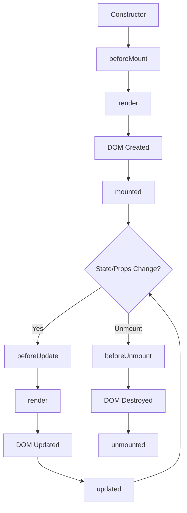

## Overview

GlyphUI components go through a lifecycle from creation to destruction. During this lifecycle, specific methods are called at key moments, allowing you to run code at specific times.

The component lifecycle has three main phases:

1. **Mounting** - Component is being created and inserted into the DOM
2. **Updating** - Component is being re-rendered due to prop or state changes
3. **Unmounting** - Component is being removed from the DOM

## Lifecycle Phases



## Mounting Lifecycle

### constructor()

Called when the component instance is created. This is where you initialize state and bind methods.

```javascript
import { Component, h } from 'glyphui';

class MyComponent extends Component {
  constructor(props) {
    super(props, {
      initialState: {
        count: 0,
        isLoading: false
      }
    });
    
    // Initialize instance properties
    this.timer = null;
    
    // Bind methods if needed (or use arrow functions)
    this.handleClick = this.handleClick.bind(this);
  }
}
```

<Warning>
Always call `super(props, { initialState })` before accessing `this` in the constructor.
</Warning>

### beforeMount()

Called immediately before the component is mounted to the DOM. The virtual DOM has been created but not yet rendered.

```javascript
class DataFetcher extends Component {
  beforeMount() {
    console.log('Component is about to mount');
    // Good place to prepare data or set flags
    this.setState({ isLoading: true });
  }
  
  render(props, state) {
    return h('div', {}, [
      state.isLoading ? 'Loading...' : 'Content'
    ]);
  }
}
```

**Use cases for beforeMount():**
- Initialize non-reactive properties
- Set loading states
- Prepare data before first render

<Note>
State changes in `beforeMount()` will be included in the initial render, avoiding an extra re-render.
</Note>

### mounted()

Called after the component has been mounted and the DOM elements are available. This is the most commonly used lifecycle method.

From `packages/runtime/src/component.js:67-86`, here's when it's called:

```javascript
mount(parentEl) {
  this.parentEl = parentEl;
  
  // Call lifecycle method before first render
  if (this.beforeMount) {
    this.beforeMount();
  }
  
  // Initial render
  this.vdom = this._renderWithSlots();
  mountDOM(this.vdom, parentEl);
  this.isMounted = true;
  
  // Called after mounting ✓
  if (this.mounted) {
    this.mounted();
  }
  
  return this;
}
```

**Example usage:**

```javascript
class TimerComponent extends Component {
  constructor(props) {
    super(props, { initialState: { seconds: 0 } });
    this.intervalId = null;
  }
  
  mounted() {
    console.log('Component mounted');
    console.log('DOM element:', this.vdom.el);
    
    // Start interval after component is in the DOM
    this.intervalId = setInterval(() => {
      this.setState(state => ({ seconds: state.seconds + 1 }));
    }, 1000);
  }
  
  render(props, state) {
    return h('div', {}, [`Seconds: ${state.seconds}`]);
  }
}
```

**Use cases for mounted():**
- Fetch data from APIs
- Set up subscriptions or timers
- Integrate with third-party libraries
- Access DOM elements directly
- Set up event listeners

From `examples/component-demo/component-demo.js:14-16`:

```javascript
mounted() {
  console.log(`Counter mounted with initial count: ${this.state.count}`);
}
```

## Update Lifecycle

### beforeUpdate(oldProps, newProps)

Called before the component re-renders due to prop or state changes. Receives the old and new props for comparison.

```javascript
class DataList extends Component {
  beforeUpdate(oldProps, newProps) {
    console.log('Component will update');
    
    // Check if specific prop changed
    if (oldProps.userId !== newProps.userId) {
      console.log('User ID changed, will fetch new data');
      this.setState({ isLoading: true });
    }
  }
  
  render(props, state) {
    return h('div', {}, [
      state.isLoading ? 'Loading...' : `Data for user ${props.userId}`
    ]);
  }
}
```

**Use cases for beforeUpdate():**
- Compare old and new props
- Prepare for updates
- Cancel pending operations
- Update derived state based on props

<Tip>
Use `beforeUpdate()` to optimize by preventing unnecessary work when specific props haven't changed.
</Tip>

### updated(oldProps, newProps)

Called after the component has re-rendered and the DOM has been updated. This is the update equivalent of `mounted()`.

From `packages/runtime/src/component.js:117-138`, here's the update flow:

```javascript
updateProps(newProps) {
  const oldProps = this.props;
  this.props = { ...this.props, ...newProps };
  
  // Extract slot content from new props.children
  if (newProps.children && Array.isArray(newProps.children)) {
    this.slotContents = extractSlotContents(newProps.children);
  }
  
  // Called before update ✓
  if (this.beforeUpdate) {
    this.beforeUpdate(oldProps, this.props);
  }
  
  // Re-render with new props
  this._renderComponent();
  
  // Called after update ✓
  if (this.updated) {
    this.updated(oldProps, this.props);
  }
}
```

**Example usage:**

```javascript
class ScrollToTop extends Component {
  updated(oldProps, newProps) {
    console.log('Component updated');
    
    // Scroll to top when page prop changes
    if (oldProps.page !== newProps.page) {
      window.scrollTo(0, 0);
    }
  }
  
  render(props) {
    return h('div', {}, [`Page ${props.page}`]);
  }
}
```

**Use cases for updated():**
- Interact with updated DOM
- Trigger animations
- Update third-party libraries
- Respond to prop changes
- Log analytics events

<Warning>
Be careful not to call `setState()` unconditionally in `updated()` - this will cause an infinite loop!
</Warning>

## Unmounting Lifecycle

### beforeUnmount()

Called immediately before the component is unmounted and destroyed. The DOM elements are still available.

```javascript
class ChatComponent extends Component {
  constructor(props) {
    super(props, { initialState: { messages: [] } });
    this.socket = null;
  }
  
  mounted() {
    // Connect to WebSocket
    this.socket = new WebSocket('ws://example.com');
    this.socket.onmessage = (event) => {
      this.setState(state => ({
        messages: [...state.messages, event.data]
      }));
    };
  }
  
  beforeUnmount() {
    console.log('Component will unmount');
    
    // Clean up before unmounting
    if (this.socket) {
      this.socket.close();
    }
  }
  
  render(props, state) {
    return h('div', {}, [
      h('ul', {}, state.messages.map(msg => h('li', {}, [msg])))
    ]);
  }
}
```

**Use cases for beforeUnmount():**
- Save component state
- Log analytics
- Clean up if cleanup requires DOM access

### unmounted()

Called after the component has been unmounted and destroyed. The DOM elements have been removed.

From `packages/runtime/src/component.js:91-111`, here's the unmount flow:

```javascript
unmount() {
  // Called before unmounting ✓
  if (this.beforeUnmount) {
    this.beforeUnmount();
  }
  
  // Clean up DOM
  if (this.vdom) {
    destroyDOM(this.vdom);
    this.vdom = null;
  }
  
  // Clean up subscriptions
  this._subscriptions.forEach(unsubscribe => unsubscribe());
  this.isMounted = false;
  
  // Called after unmounting ✓
  if (this.unmounted) {
    this.unmounted();
  }
}
```

**Example usage:**

```javascript
class AnalyticsTracker extends Component {
  mounted() {
    this.startTime = Date.now();
    console.log('User entered page');
  }
  
  unmounted() {
    const duration = Date.now() - this.startTime;
    console.log(`User spent ${duration}ms on page`);
    
    // Send analytics
    analytics.track('page_view_duration', { duration });
  }
  
  render(props) {
    return h('div', {}, [props.children]);
  }
}
```

**Use cases for unmounted():**
- Final cleanup operations
- Clear timers and intervals
- Unsubscribe from services
- Close connections
- Log final state

<Note>
The component's DOM elements are no longer available in `unmounted()`. Use `beforeUnmount()` if you need DOM access.
</Note>

## Complete Lifecycle Example

Here's a component that uses all lifecycle methods:

```javascript
import { Component, h } from 'glyphui';

class LifecycleDemo extends Component {
  constructor(props) {
    super(props, {
      initialState: {
        data: null,
        isLoading: false,
        error: null
      }
    });
    
    this.intervalId = null;
    console.log('1. Constructor called');
  }
  
  beforeMount() {
    console.log('2. beforeMount called');
    this.setState({ isLoading: true });
  }
  
  mounted() {
    console.log('4. mounted called');
    
    // Fetch data
    fetch(`/api/data/${this.props.id}`)
      .then(res => res.json())
      .then(data => {
        this.setState({ data, isLoading: false });
      })
      .catch(error => {
        this.setState({ error: error.message, isLoading: false });
      });
    
    // Start polling
    this.intervalId = setInterval(() => {
      console.log('Polling for updates...');
    }, 5000);
  }
  
  beforeUpdate(oldProps, newProps) {
    console.log('5. beforeUpdate called');
    
    // Refetch if ID changed
    if (oldProps.id !== newProps.id) {
      this.setState({ isLoading: true });
    }
  }
  
  updated(oldProps, newProps) {
    console.log('6. updated called');
    
    // Refetch data when ID changes
    if (oldProps.id !== newProps.id) {
      fetch(`/api/data/${newProps.id}`)
        .then(res => res.json())
        .then(data => {
          this.setState({ data, isLoading: false });
        });
    }
  }
  
  beforeUnmount() {
    console.log('7. beforeUnmount called');
    
    // Save current state to localStorage
    if (this.state.data) {
      localStorage.setItem('lastData', JSON.stringify(this.state.data));
    }
  }
  
  unmounted() {
    console.log('8. unmounted called');
    
    // Clean up interval
    if (this.intervalId) {
      clearInterval(this.intervalId);
    }
  }
  
  render(props, state) {
    console.log('3. render called');
    
    if (state.error) {
      return h('div', { class: 'error' }, [`Error: ${state.error}`]);
    }
    
    if (state.isLoading) {
      return h('div', { class: 'loading' }, ['Loading...']);
    }
    
    return h('div', {}, [
      h('h2', {}, ['Data:']),
      h('pre', {}, [JSON.stringify(state.data, null, 2)])
    ]);
  }
}
```

## Lifecycle in Functional Components

Functional components don't have lifecycle methods. Instead, they use hooks:

| Lifecycle Method | Hook Equivalent |
|-----------------|----------------|
| `mounted()` | `useEffect(() => { ... }, [])` |
| `updated()` | `useEffect(() => { ... })` |
| `unmounted()` | `useEffect(() => { return () => { ... } }, [])` |
| `beforeMount()` | Run code before hooks |
| `beforeUpdate()` | Compare in `useEffect()` |
| `beforeUnmount()` | Cleanup in `useEffect()` |

**Example with hooks:**

```javascript
import { h, useState, useEffect } from 'glyphui';

function DataComponent(props) {
  const [data, setData] = useState(null);
  
  // Equivalent to mounted() and unmounted()
  useEffect(() => {
    console.log('Component mounted');
    
    const intervalId = setInterval(() => {
      console.log('Polling...');
    }, 5000);
    
    // Cleanup function (equivalent to unmounted)
    return () => {
      console.log('Component will unmount');
      clearInterval(intervalId);
    };
  }, []);
  
  // Equivalent to updated() when props.id changes
  useEffect(() => {
    console.log('ID changed, fetching data');
    
    fetch(`/api/data/${props.id}`)
      .then(res => res.json())
      .then(setData);
  }, [props.id]);
  
  return h('div', {}, [
    data ? JSON.stringify(data) : 'Loading...'
  ]);
}
```

See the [Hooks Overview](/hooks/overview) for more details on using hooks.

## Best Practices

<Accordion title="Always Clean Up Resources">
If you set up timers, subscriptions, or event listeners in `mounted()`, always clean them up in `unmounted()` to prevent memory leaks.

```javascript
mounted() {
  this.intervalId = setInterval(() => { /* ... */ }, 1000);
}

unmounted() {
  clearInterval(this.intervalId);  // ✓ Always clean up
}
```
</Accordion>

<Accordion title="Don't Call setState() in render()">
Calling `setState()` in `render()` causes an infinite loop. Only call it in lifecycle methods or event handlers.

```javascript
// ✗ BAD - Infinite loop
render() {
  this.setState({ count: 1 });
  return h('div', {}, []);
}

// ✓ GOOD - Call in lifecycle method
mounted() {
  this.setState({ count: 1 });
}
```
</Accordion>

<Accordion title="Be Careful with setState() in updated()">
Always use a condition when calling `setState()` in `updated()`, or you'll create an infinite loop.

```javascript
// ✗ BAD - Infinite loop
updated() {
  this.setState({ timestamp: Date.now() });
}

// ✓ GOOD - Conditional update
updated(oldProps, newProps) {
  if (oldProps.userId !== newProps.userId) {
    this.setState({ isLoading: true });
  }
}
```
</Accordion>

<Accordion title="Use beforeMount() for Initial Setup">
Use `beforeMount()` for setup that should happen before the first render, preventing an extra re-render.

```javascript
// ✓ Better - No extra render
beforeMount() {
  this.setState({ isLoading: true });
}

// ✗ Works but causes extra render
mounted() {
  this.setState({ isLoading: true });
}
```
</Accordion>

## Next Steps

- [Hooks Overview](/hooks/overview) - Learn about lifecycle in functional components
- [useEffect Hook](/hooks/use-effect) - Handle side effects and lifecycle events
- [Component API](/api/component) - Complete API reference for components
- [Performance](/advanced/performance) - Optimize component rendering