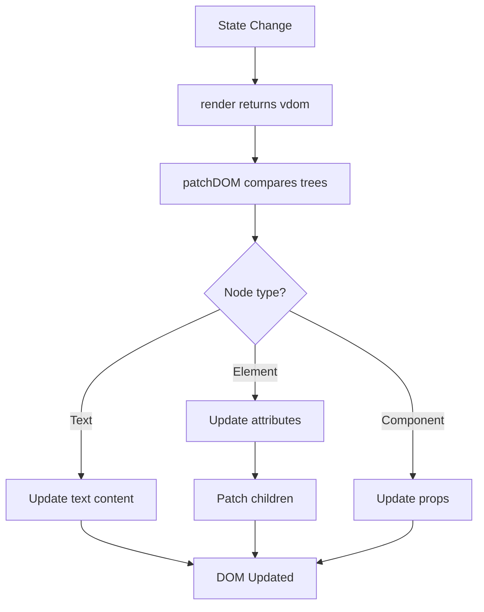

## Overview

GlyphUI's rendering system consists of two main processes:

1. **Mounting** - Creating real DOM elements from virtual nodes and inserting them into the page
2. **Patching** - Efficiently updating the DOM when state changes by comparing old and new virtual trees

## Mounting Process

Mounting is the initial render when your application or component first appears. The `mountDOM()` function from `packages/runtime/src/mount-dom.js` creates real DOM nodes from your virtual DOM tree.

### How Mounting Works

When you mount a component:

```javascript
const app = new CounterApp();
app.mount(document.querySelector('main'));
```

GlyphUI performs these steps:

1. Calls the component's `render()` method to get the virtual DOM
2. Traverses the virtual tree recursively
3. Creates corresponding real DOM elements
4. Attaches event listeners and attributes
5. Inserts elements into the parent element

### Mounting Different Node Types

From `packages/runtime/src/mount-dom.js:25-49`, GlyphUI handles four types of nodes:

<Accordion title="Text Nodes">
**Text nodes** are created using `document.createTextNode()`:

```javascript
function createTextNode(vdom, parentEl, index) {
  const { value } = vdom;
  const textNode = document.createTextNode(value);
  vdom.el = textNode;  // Store reference to real DOM node
  insert(textNode, parentEl, index);
}
```

The real DOM node is stored in `vdom.el` for future updates.
</Accordion>

<Accordion title="Element Nodes">
**Element nodes** create HTML elements with attributes and children:

```javascript
function createElementNode(vdom, parentEl, index) {
  const { tag, props, children } = vdom;
  
  const element = document.createElement(tag);
  addProps(element, props, vdom);  // Add attributes and event listeners
  vdom.el = element;
  
  children.forEach((child) => mountDOM(child, element));
  insert(element, parentEl, index);
}
```

Children are recursively mounted before the parent is inserted.
</Accordion>

<Accordion title="Fragment Nodes">
**Fragments** render their children directly without a wrapper element:

```javascript
function createFragmentNodes(vdom, parentEl, index) {
  const { children } = vdom;
  vdom.el = parentEl;  // Reference parent since fragment has no element
  
  children.forEach((child, i) =>
    mountDOM(child, parentEl, index ? index + i : null)
  );
}
```

<Note>
Fragments don't create a DOM element. The `vdom.el` property references the parent element instead.
</Note>
</Accordion>

<Accordion title="Component Nodes">
**Components** are processed by instantiating the component class and mounting it:

```javascript
processComponent(vdom, parentEl, index);
```

See the [Components](/concepts/components) page for details.
</Accordion>

### Adding Props and Event Listeners

From `packages/runtime/src/mount-dom.js:95-100`, props are split into event listeners and attributes:

```javascript
function addProps(el, props, vdom) {
  const { on: events, ...attrs } = props;
  
  vdom.listeners = addEventListeners(events, el);
  setAttributes(el, attrs);
}
```

Event listeners are stored in `vdom.listeners` so they can be removed later during unmounting.

## Patching Process

Patching is the core reconciliation algorithm that efficiently updates the DOM when state changes. Instead of recreating everything, GlyphUI intelligently determines what actually changed.

### The patchDOM Algorithm

From `packages/runtime/src/patch-dom.js:19-118`, the patching process follows these steps:

```javascript
export function patchDOM(oldVdom, newVdom, parentEl, index) {
  // 1. Mount if there's no old vdom
  if (!oldVdom) {
    mountDOM(newVdom, parentEl, index);
    return newVdom;
  }
  
  // 2. Destroy if there's no new vdom
  if (!newVdom) {
    destroyDOM(oldVdom);
    return null;
  }
  
  // 3. Fast path: identical references mean nothing changed
  if (oldVdom === newVdom) {
    return newVdom;
  }
  
  // 4. Replace if node types differ
  if (oldVdom.type !== newVdom.type) {
    replaceNode(oldVdom, newVdom, parentEl, index);
    return newVdom;
  }
  
  // 5. Patch based on specific node type
  switch (newVdom.type) {
    case DOM_TYPES.TEXT:
      return patchText(oldVdom, newVdom);
    case DOM_TYPES.ELEMENT:
      return patchElement(oldVdom, newVdom);
    case DOM_TYPES.FRAGMENT:
      return patchChildren(oldVdom, newVdom);
    case COMPONENT_TYPE:
      return patchComponent(oldVdom, newVdom);
  }
}
```

### Patching Strategies

#### Text Nodes

For text nodes, only update if the value changed:

```javascript
function patchText(oldVdom, newVdom) {
  const el = oldVdom.el;
  newVdom.el = el;  // Reuse the same DOM node
  
  if (oldVdom.value !== newVdom.value) {
    el.nodeValue = newVdom.value;  // Update text content
  }
  
  return newVdom;
}
```

#### Element Nodes

For elements, update attributes and patch children:

```javascript
function patchElement(oldVdom, newVdom) {
  const el = oldVdom.el;
  newVdom.el = el;  // Reuse existing DOM element
  
  // Update attributes and event listeners
  if (!isShallowEqual(oldVdom.props, newVdom.props)) {
    updateAttributes(el, oldVdom.props, newVdom.props);
    updateEventListeners(el, oldVdom, newVdom);
  }
  
  // Recursively patch children
  patchChildren(oldVdom, newVdom);
  
  return newVdom;
}
```

<Tip>
GlyphUI reuses the existing DOM element and only updates what changed. This is much faster than destroying and recreating elements.
</Tip>

### Children Reconciliation

GlyphUI uses two algorithms for updating children, depending on whether keys are present:

#### Unkeyed Reconciliation

Without keys, children are patched by index:

```javascript
function patchUnkeyedChildren(oldChildren, newChildren, parentEl) {
  const maxLength = Math.max(oldChildren.length, newChildren.length);
  
  for (let i = 0; i < maxLength; i++) {
    const oldChild = oldChildren[i];
    const newChild = newChildren[i];
    patchDOM(oldChild, newChild, parentEl, i);
  }
}
```

<Warning>
Unkeyed reconciliation can cause issues when reordering lists. Always use keys for dynamic lists.
</Warning>

#### Keyed Reconciliation

With keys, GlyphUI can efficiently handle reordering, insertions, and deletions:

```javascript
function patchKeyedChildren(oldChildren, newChildren, parentEl) {
  // Build a map of old children by key
  const oldKeyMap = new Map();
  oldChildren.forEach((child, i) => {
    const key = getNodeKey(child);
    if (key !== undefined) {
      oldKeyMap.set(key, { vdom: child, index: i });
    }
  });
  
  const patchedKeys = new Set();
  
  // Patch or mount new children
  for (let i = 0; i < newChildren.length; i++) {
    const newChild = newChildren[i];
    const newKey = getNodeKey(newChild);
    const oldEntry = oldKeyMap.get(newKey);
    
    if (oldEntry) {
      // Key found: patch existing node
      patchDOM(oldEntry.vdom, newChild, parentEl, i);
      patchedKeys.add(newKey);
      
      // Move node if needed
      if (oldEntry.index < lastPatchedIndex) {
        parentEl.insertBefore(newChild.el, referenceNode);
      }
    } else {
      // Key not found: mount new node
      mountDOM(newChild, parentEl, i);
    }
  }
  
  // Remove old children not in new list
  oldKeyMap.forEach((oldEntry, key) => {
    if (!patchedKeys.has(key)) {
      destroyDOM(oldEntry.vdom);
    }
  });
}
```

### Using Keys for Lists

Always provide unique keys when rendering lists:

```javascript
render(props, state) {
  return h('ul', {}, 
    state.items.map(item => 
      h('li', { key: item.id }, [item.name])
    )
  );
}
```

Keys help GlyphUI identify which items changed, were added, or were removed:

<CodeGroup>
```javascript Good - With Keys
state.counters.map(counter => 
  createComponent(Counter, {
    key: counter.id,  // Unique identifier
    title: counter.title
  })
)
```

```javascript Bad - Without Keys
state.counters.map(counter => 
  createComponent(Counter, {
    title: counter.title  // Will cause issues when reordering
  })
)
```
</CodeGroup>

## Component Patching

When patching components, GlyphUI updates props without unmounting:

```javascript
function patchComponent(oldVdom, newVdom) {
  const { instance } = oldVdom;
  
  newVdom.instance = instance;  // Reuse component instance
  newVdom.el = oldVdom.el;
  
  // Only update if props changed
  if (!isShallowEqual(oldVdom.props, newVdom.props)) {
    instance.updateProps(newVdom.props);
  }
  
  return newVdom;
}
```

This preserves component state and avoids expensive re-initialization.

## Destroying DOM

When elements are removed, GlyphUI cleans up properly from `packages/runtime/src/destroy-dom.js`:

1. Removes event listeners to prevent memory leaks
2. Recursively destroys children
3. Calls component lifecycle methods (`beforeUnmount`, `unmounted`)
4. Removes elements from the DOM
5. Cleans up references

```javascript
function removeElementNode(vdom) {
  const { el, listeners, children } = vdom;
  
  // Remove event listeners
  if (listeners) {
    removeEventListeners(listeners, el);
  }
  
  // Destroy children
  if (children) {
    children.forEach(destroyDOM);
  }
  
  // Remove from DOM
  el.remove();
  vdom.el = null;
}
```

## Performance Optimizations

GlyphUI includes several optimizations:

### Shallow Equality Checks

Props are compared using shallow equality before updating:

```javascript
if (!isShallowEqual(oldVdom.props, newVdom.props)) {
  updateAttributes(el, oldVdom.props, newVdom.props);
}
```

### Reference Equality Fast Path

If virtual nodes are identical (same reference), skip all processing:

```javascript
if (oldVdom === newVdom) {
  return newVdom;  // Nothing changed
}
```

### Batched Updates

Component state updates trigger re-renders through a dispatcher that batches changes.

## Rendering Lifecycle

Here's the complete flow from state change to DOM update:

1. User triggers state change (`setState()` or hook update)
2. Component's `_renderComponent()` is called
3. `render()` method returns new virtual DOM
4. `patchDOM()` compares old and new trees
5. Minimal DOM operations are applied
6. Lifecycle methods are called (`updated`, etc.)



## Next Steps

- [Components](/concepts/components) - Learn about building reusable UI components
- [Lifecycle](/concepts/lifecycle) - Understand component lifecycle methods
- [Performance](/advanced/performance) - Advanced optimization techniques